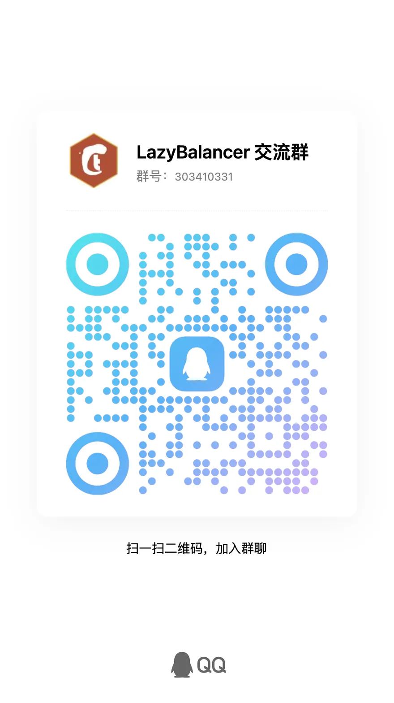

# Lazy Balancer V2

[English](README.en.md) | 简体中文

基于 **Caddy v2.11** 的可视化负载均衡管理平台，内置 WAF 安全防护，单容器交付。

## 功能一览

| 功能 | 说明 |
|---|---|
| 负载均衡 | HTTP/HTTPS/TCP 四层代理，多种策略，健康检查，路径路由 |
| WAF 防护 | OWASP CRS + 自定义规则 + IP 控制 + 地域拦截 + 限流 |
| 免费证书 | ACME 自动签发（DNS-01），自动续签 |
| 主从集群 | 增量同步，防篡改签名，从节点只读，一键提升 |
| 监控告警 | 流量/延迟 P50-99，上游健康，安全事件总览 |
| MCP 服务 | AI 代理可通过 127 个工具操作全部功能 |

## 快速开始

```bash
docker run -d --name lazy-balancer --network host \
  --ulimit nofile=1048576:1048576 \
  -v $(pwd)/data:/app/data -v $(pwd)/certs:/app/certs \
  -v $(pwd)/logs:/app/logs -v $(pwd)/waf:/app/waf \
  v55448330/lazy-balancer-v2:latest
```

打开 `http://localhost:8000` 进入管理面板。首次访问进入初始化向导，无默认凭据。

<details>
<summary>Docker Compose / 构建源码</summary>

```bash
# Docker Compose
docker compose up -d

# 从源码构建
cd web && npm install && npm run build && cd ..
docker buildx build --platform linux/amd64,linux/arm64 \
  --build-arg VERSION=v2.2.7 \
  -t v55448330/lazy-balancer-v2:v2.2.7 --push .
```
</details>

## 文档

| 文档 | 内容 |
|---|---|
| [部署指南](docs/deployment.zh-CN.md) | 挂载目录、环境变量、端口、生产参数 |
| [安全配置](docs/security.zh-CN.md) | WAF 策略、IP 控制、事件采集、规则更新 |
| [集群管理](docs/cluster.zh-CN.md) | 主从架构、MFA、安全模型、升级须知 |
| [生产调优](docs/production-tuning.zh-CN.md) | 内核/容器/LB/WAF/HTTP3 五层调优 |
| [API 文档](docs/api.zh-CN.md) | REST 端点概览、认证、错误码 |
| [MCP 文档](docs/mcp.zh-CN.md) | AI 代理接入、工具权限、工作流示例 |

## 交流群

<div align="center">

**LazyBalancer 交流群** · 群号：**303410331**



</div>

## 技术栈

Go 1.26 · Gin · SQLite · Caddy v2.11 · Coraza v3 · OWASP CRS v4 · Vue 3 · Element Plus

## License

[Apache License 2.0](LICENSE)
